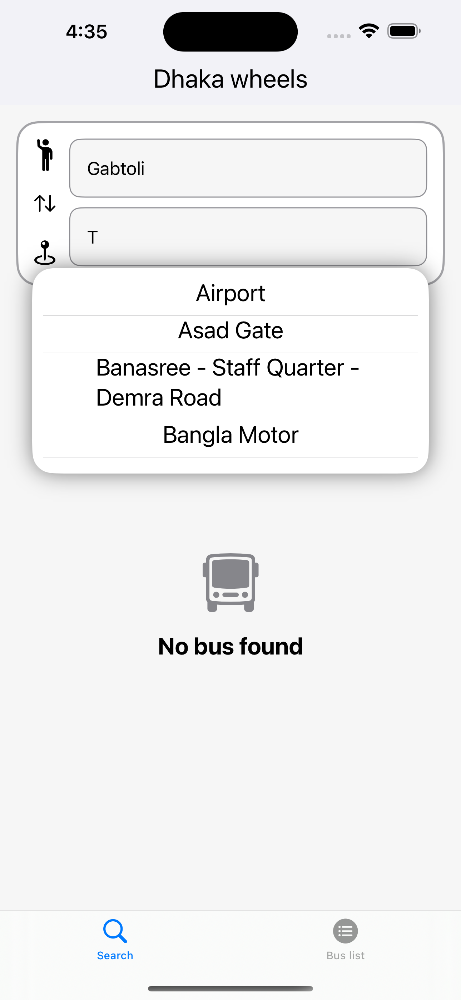
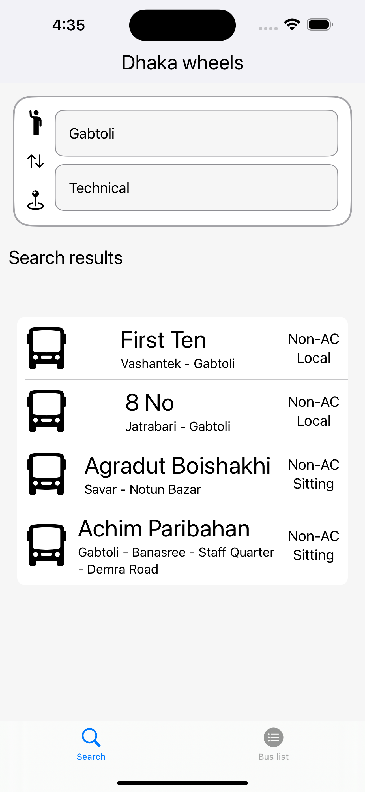
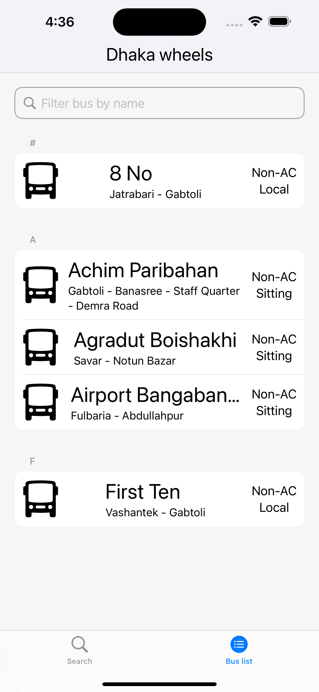
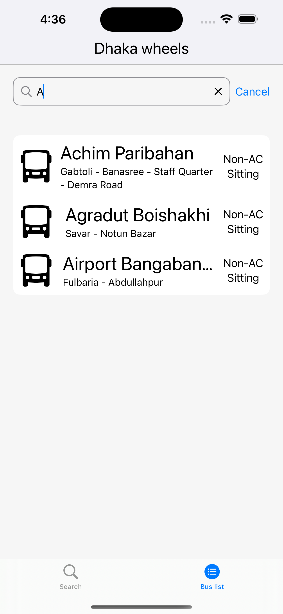
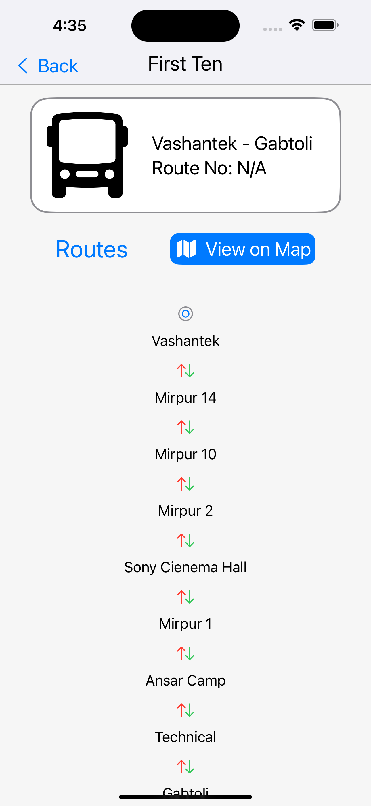

##  Dhaka Wheels - Local Bus Finder
  

Dhaka Wheels is your go-to solution for finding local bus routes in Dhaka, Bangladesh. This iOS app is designed to make your daily commute easier by providing real-time information on bus routes, schedules, and stops within the city.

     


### Getting Started

#### Prerequisites
- Xcode 15.0 or later
- iOS 17.0 or later

#### Installation
1. Clone the repository :
``` bash
git clone https://github.com/Asad51/Dhaka-Wheels.git
```
2. Open the project in Xcode.
3. Build and run the app on the iOS simulator
4. To run on a real device, you will need to locally modify the signing options:
    - Click on "Dhaka Wheels" at the top of the left sidebar
    - Click on the "Signing & Capabilities" tab
    - Under "Targets", select "Dhaka Wheels"
    - In the "Team" dropdown, select your name. If your name doesn't appear, you may need to sign into Xcode with your Apple developer account.
    - Change the "Bundle Identifier" to something different. You can add your name or some random letters to make it unique.
    - Now you can select your Apple device in the top bar as a target and click the Play button to run.

#### Issues
If you encounter any issues or have suggestions for improvement, please [open an issue](https://github.com/Asad51/Dhaka-Wheels/issues).

#### License
This project is licensed under the MIT License - see the [LICENSE](https://github.com/Asad51/Dhaka-Wheels/blob/main/LICENSE) file for details.

